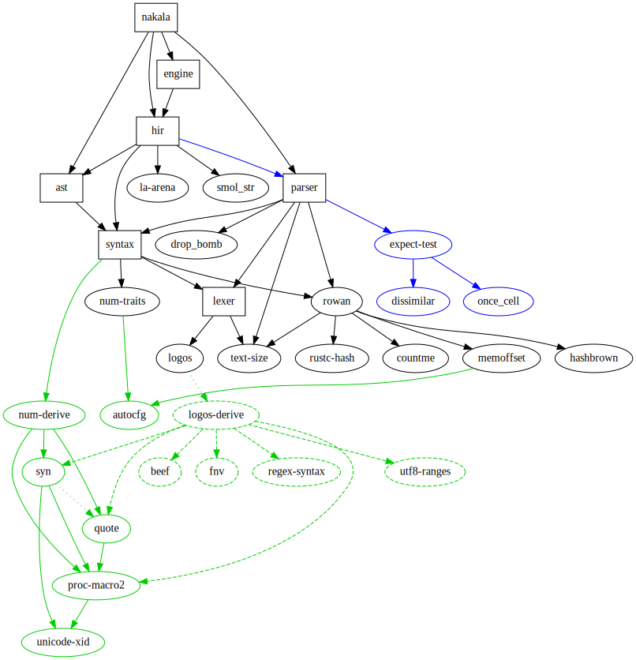

# nakala

A programming language that I built based on [azrg's Eldiro blog posts](https://arzg.github.io/lang/). The core design and architecture are all practically identical to Eldiro, hence the name of the project: nakala (Punjabi for _mimic_). If you haven't read through his blog posts, I highly recommend you do because it is an unmatched learning resource.

### Why make nakala?
I was so inspired by his blog posts that I have decided to continue the implementation that I made while reading his posts. The most notable of which being creating a runtime engine that computes the parsed `HIR` representation.

## Features
As nakala is in its very early stages, the language does not have many features. However, it does have:

#### Binary Expressions
Prefix, Infix, and Postfix binary expression support
```
1 + 4 * 10 + -4

200 + (5 * (100 + 4))
```

#### Comments
You can have comments placed within expressions
```
1 
+ 123 # add a medium number
+ 5512312 # add a large number
```

#### Variable Declaration and References
```
let a = 200 + (5 * (100 + 4))
let b = a
```

## Project Layout
There are a fair amount of moving parts, and just like azrg, I have also split up all the components into separate crates. Below is a dependency graph to visualize how it all links together:
<p align="center" style="width: 90%; margin: auto; margin-top: 20px">
  
</p>


## Usage
Nakala comes with a REPL CLI tool located in `/crates/nakala`. You can clone the project and run the following to use it:

```bash
$ cargo run
```


