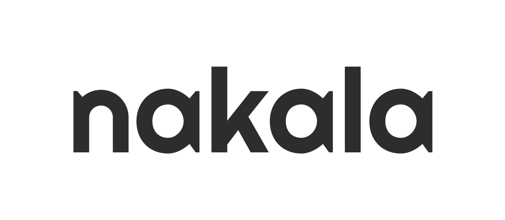

  

### Why make nakala?

> Note: see _History_

After learning about progrmaming languages for over a year (including books, college level courses, multiple side projects, etc.), I've decided I want to make my own, general purpose programming language.

### Philosophy

Nakala only has two core values:

1. The syntax should feel familiar, while remaining unique
2. Nakala doesn't try to do anything _really hard_, as I want to make working on this project fun and not another job that ends up burning me out.

### Roadmap

- [x] Lexer
- [x] Parser / AST
- [x] Type Checking
  - [x] Basic types
  - [x] Advanced types (functions, classes, enums)
- [x] Interpreter
- [ ] Standard library
- [x] [Playground website](https://nakala-lang.github.io/website/)
- [ ] Editor tooling
  - [x] [vim](https://github.com/nakala-lang/nakala.vim)
- [ ] Compiler (maybe C++?)
- [ ] Self hosted

### Contributing
I am always welcoming PRs and would love to work on the project with other people if they are interested. There are no rules, and I will accept any PR as long as it aligns with the projects core values as described above.

---

#### History

Nakala started as a programming language that I built based on [arzg's Eldiro blog posts](https://arzg.github.io/lang/). 
The core architecture (especially the Parser) was practically identical to Eldiro, hence the name of the project: nakala (Punjabi for _mimic_).
If you haven't read through his blog posts, I highly recommend you do because it is an unmatched learning resource.

I ended up scrapping the entire language and implementation for something I built from the ground up after studying more. However, I decided to keep the name as a nod to arzg for lighting a spark in me that put me on a journey of learning constantly.

#### License
`nakala` uses the MIT License
