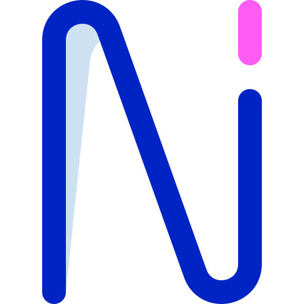
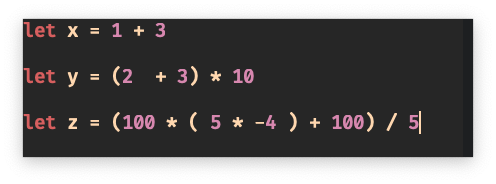
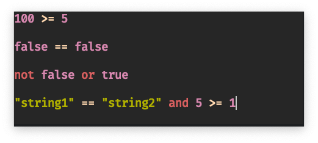
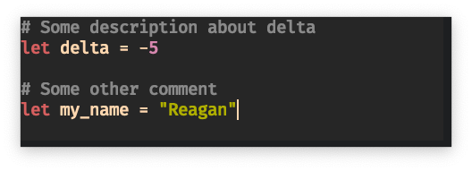
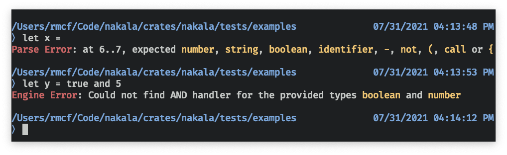
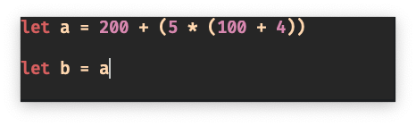
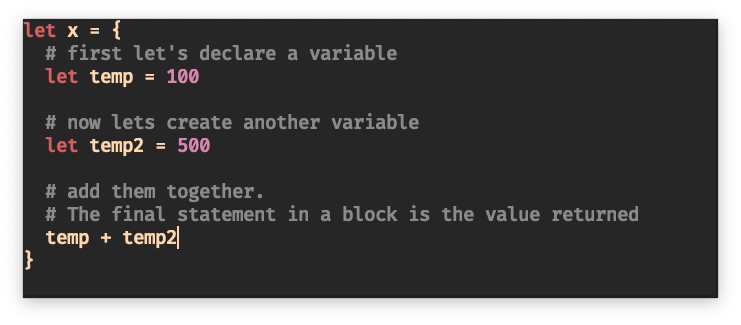
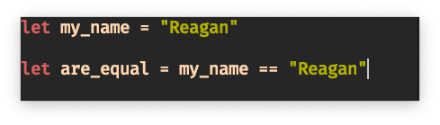
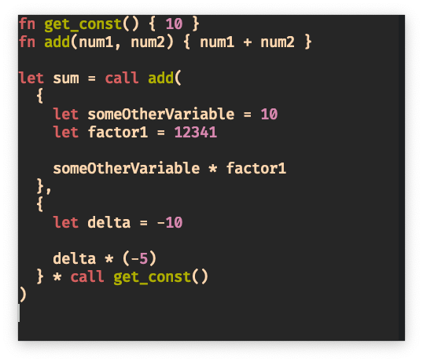

# nakala

<p align="center">
  
</p>

[](https://github.com/reaganmcf/nakala/actions/workflows/CI.yml)

A programming language that I built based on [arzg's Eldiro blog posts](https://arzg.github.io/lang/). 
The core design and architecture is practically identical to Eldiro, hence the name of the project: nakala (Punjabi for _mimic_). 
If you haven't read through his blog posts, I highly recommend you do because it is an unmatched learning resource.

### Why make nakala?
I was so inspired by his blog posts that I have decided to continue the implementation that I made while reading his posts.

The most notable and interesting things I have implemented since continuing my implementation is a runtime engine that computes the parsed `HIR` representation and the countless additional language features.

## Features
As nakala is in its very early stages, the language does not have many features. However, it does have:

#### Binary Expressions
<p align="center">
  
</p>

#### Boolean Expressions
<p align="center">
  
</p>

#### Comments
<p align="center">
  
</p>

#### Error Handling

<p align="center">
  
</p>

#### Variable Declaration and References
<p align="center">
  
</p>

#### Code Blocks
<p align="center">
  
</p>

#### Strings
<p align="center" />
  
</p>

#### Functions
<p align="center" />
  
</p>

#### `.nak` File Format

You can store a nakala program in a `.nak` file and run it using the CLI tool. For example:

<p align="center">
  
</p>

## Project Layout
There are a fair amount of moving parts, and just like arzg, I have also split up all the components into separate crates. Below is a dependency graph to visualize how it all links together:
<p align="center" style="width: 100%; margin: auto; margin-top: 20px">
  
</p>

## Usage
Nakala comes with a REPL CLI tool located in `/crates/nakala`. You can clone the project and run the following to use it:

```bash
$ cargo run
```

---

### License
`nakala` uses the MIT License

#### Attributions
<div>Icons made by <a href="https://www.freepik.com" title="Freepik">Freepik</a> from <a href="https://www.flaticon.com/" title="Flaticon">www.flaticon.com</a></div>
