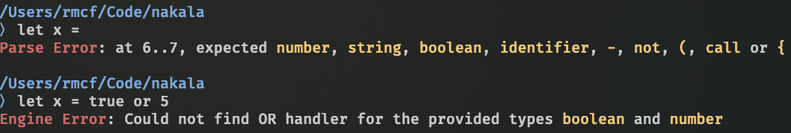

# nakala

<p align="center">
  
</p>

[](https://github.com/reaganmcf/nakala/actions/workflows/CI.yml)

A programming language that I built based on [arzg's Eldiro blog posts](https://arzg.github.io/lang/). 
The core design and architecture is practically identical to Eldiro, hence the name of the project: nakala (Punjabi for _mimic_). 
If you haven't read through his blog posts, I highly recommend you do because it is an unmatched learning resource.

### Why make nakala?
I was so inspired by his blog posts that I have decided to continue the implementation that I made while reading his posts.

The most notable and interesting things I have implemented since continuing my implementation is a runtime engine that computes the parsed `HIR` representation and the countless additional language features.

## Features
As nakala is in its very early stages, the language does not have many features. However, it does have:

#### Binary Expressions
Prefix, Infix, and Postfix binary expression support
```
1 + 4 * 10 + -4

200 + (5 * (100 + 4))
```

#### Boolean Expressions
```
100 >= 5 

false == false 

not false or true 

"string1" == "string1" and 5 >= 1 
```

#### Comments
You can have comments placed within expressions
```
1 
+ 123 # add a medium number
+ 5512312 # add a large number
```

#### Error Handling
Nakala supports Runtime and Parse errors, with colored output



#### Variable Declaration and References
```
let a = 200 + (5 * (100 + 4))

let b = a
```

#### Code Blocks
```
let x = {
  # first let's declare a variable
  let temp = 100

  # now lets create another variable
  let temp2 = 500

  # add them together. The final statement in a block is the value returned
  temp + temp2
}
```

#### Strings
```
let x = "Hello, World!"
```

#### Functions
```
fn get_my_name() { "Reagan" }

# since code blocks are expressions, crazy things like this totally work :^)
fn get_const() { 10 }
fn add(num1, num2) { num1 + num2 }

let sum = call add (
  {
    let someOtherVariable = 10
    let factor1 = 12341

    someOtherVariable * factor1

  },
  {
    let delta = -10
    
    delta * (-5)
  } * call get_const()
)

sum # output is 12391
```

#### `.nak` File Format

You can store a nakala program in a `.nak` file and run it using the CLI tool. For example:

```
# my_program.nak

let x = 100

let y = x + 5

x + y
```

You can then run this program with the following command

```
$ nakala my_program.nak

110
```

## Project Layout
There are a fair amount of moving parts, and just like arzg, I have also split up all the components into separate crates. Below is a dependency graph to visualize how it all links together:
<p align="center" style="width: 100%; margin: auto; margin-top: 20px">
  
</p>

## Usage
Nakala comes with a REPL CLI tool located in `/crates/nakala`. You can clone the project and run the following to use it:

```bash
$ cargo run
```

---

### License
`nakala` uses the MIT License

#### Attributions
<div>Icons made by <a href="https://www.freepik.com" title="Freepik">Freepik</a> from <a href="https://www.flaticon.com/" title="Flaticon">www.flaticon.com</a></div>
